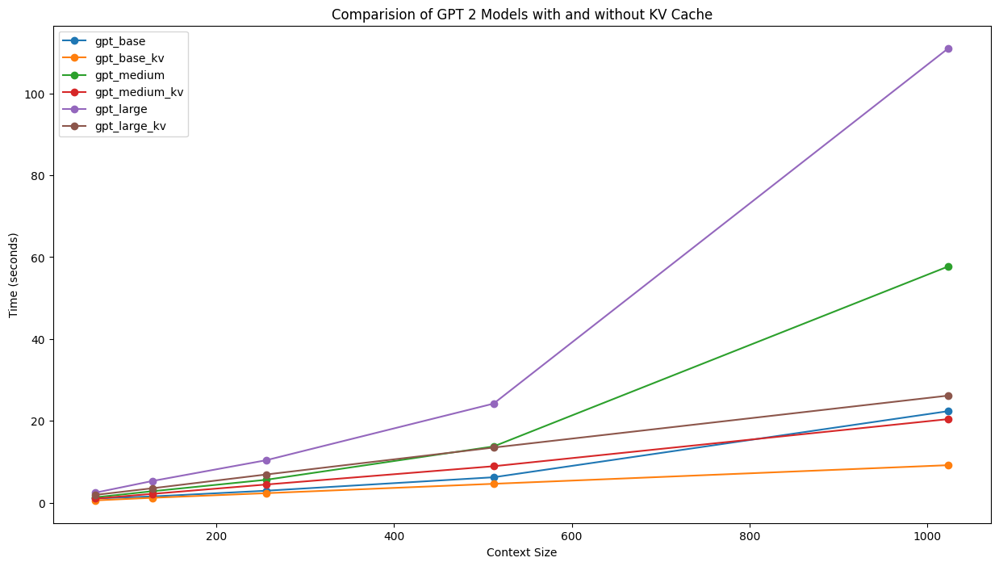

# nanoGPT + KV Cache


This repository is based on Andrej Karpathy's [nanoGPT](https://github.com/karpathy/nanoGPT). The code for the GPT model has been modfied to support a basic KV Cache in order to speed-up inference. Even a simple implementation of the KV Cache dramatically speeds up inference. The speed-up achieved increases with increase in Decoder Layers as we can cache in every layer. For a detailed explanation of the working of a KV Cache, read the KV Cache section below.  


## Jump To
* <a id="jumpto"></a> [Install](#install-)
* <a id="jumpto"></a> [KV Cache](#kv-cache-)
* <a id="jumpto"></a> [Inference](#inference-)
* <a id="jumpto"></a> [Results](#results-)
* <a id="jumpto"></a> [Possible Improvements](#possible-improvements-)
* <a id="jumpto"></a> [References](#references-)

**Note**- To isolate the speed-up achieved through a KV Cache, support for Flash Attention in the original repository has been disabled.
# Install [`↩`](#jumpto)
```
git clone https://github.com/rajlm10/nanoGPT_KV_Cache.git
cd nanoGPT_KV_Cache
pip install torch numpy transformers datasets tiktoken wandb tqdm
```

# KV Cache [`↩`](#jumpto)
TODO


# Inference [`↩`](#jumpto)
To run the original implementation without a KV Cache
```
!python sample.py --init_from=gpt2 --max_new_tokens=1024 --start="What is the answer to life, the universe, and everything?" --num_samples=10 
```
To run the modified implementation with a KV Cache
```
!python modified_sample.py --init_from=gpt2 --max_new_tokens=1024 --start="What is the answer to life, the universe, and everything?" --num_samples=10 
```
Providing no start flag also works, the average generation time taken per sample is printed at the end along with all the generated samples.

**Choose model**- The init_from flag allows loading pretrained HuggingFace checkpoints and supports gpt2, gpt-medium, gpt2-large


# Results [`↩`](#jumpto)

**The results are averaged across 10 runs, on a NVIDIA T4 16GB GPU**



| model | params | decoder layers| time(s)| speedup |
| ------| ------ | ---------- |---------- | ---------- | 
| gpt2 | 124M | 12|  22.39 |
| gpt2-kv | 124M  | 12| 9.19  | 2.44X|
| gpt2-medium | 350M  |24 | 57.75  | 
| gpt2-medium-kv | 350M  |24 | 20.44  | 2.82X|
| gpt2-large | 774M   | 36| 111.04  |
| gpt2-large-kv | 774M   |36  | 26.18  | 4.24X|

# Possible Improvements [`↩`](#jumpto)
- Instead of copying over the updated cache naively for each layer, in-place extend previous cache

# References [`↩`](#jumpto)
[[1] Andrej Karpathy's Nano GPT](https://github.com/karpathy/nanoGPT) 

[[2] Transformer Arithmetic Blog]([https://arxiv.org/abs/1810.04805](https://kipp.ly/transformer-inference-arithmetic/)) 

